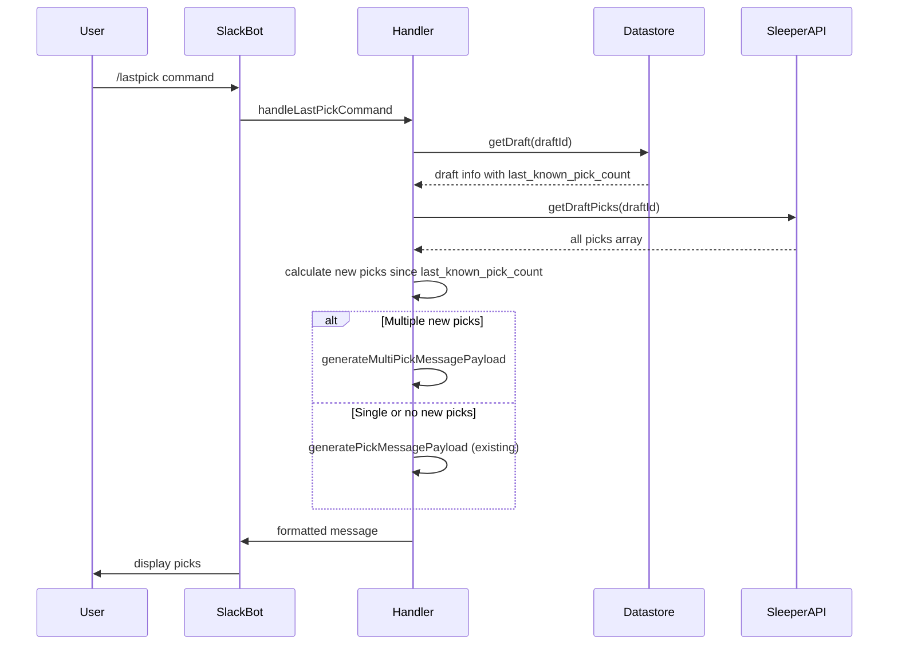

# Design Document

## Overview

The multi-pick last pick feature enhances the existing `/lastpick` command to display all players drafted since the last monitor update, rather than just the most recent pick. This design leverages the existing `last_known_pick_count` field stored in the DynamoDB datastore to determine which picks are "new" since the last monitor run.

The solution maintains backward compatibility with the existing single-pick display while adding multi-pick functionality when multiple picks have occurred between monitor updates.

## Architecture

The enhancement builds upon the existing architecture:

1. **Data Layer**: Uses existing DynamoDB storage with `last_known_pick_count` field
2. **Service Layer**: Extends existing Sleeper API integration and datastore services
3. **Handler Layer**: Modifies the existing `lastpick.js` handler to support multi-pick display
4. **Message Generation**: Creates new message formatting for multiple picks while reusing existing components

### Data Flow



## Components and Interfaces

### Modified Components

#### 1. `handlers/lastpick.js`
- **New Function**: `generateMultiPickMessagePayload(draft, picks, newPicksStartIndex, data, notifyNextPicker)`
- **Modified Function**: `handleLastPickCommand` - adds logic to determine if multiple picks should be displayed
- **Helper Function**: `getNewPicksSinceLastUpdate(picks, lastKnownPickCount)` - extracts new picks from the full picks array

#### 2. Message Payload Structure
```javascript
// Multi-pick message structure
{
  text: "3 new picks since last update: ...", // fallback text
  blocks: [
    { type: "section", text: "🚨 MULTIPLE PICKS ALERT! 🚨" },
    { type: "section", text: "3 new picks since last update:" },
    { type: "divider" },
    // Individual pick blocks (reusing existing format)
    { type: "section", fields: [...] }, // Pick 1
    { type: "section", fields: [...] }, // Pick 2  
    { type: "section", fields: [...] }, // Pick 3
    { type: "divider" },
    { type: "section", text: "On The Clock: ..." }
  ]
}
```

### New Interfaces

#### Pick Range Calculation
```javascript
interface PickRange {
  startIndex: number;    // Index of first new pick
  endIndex: number;      // Index of last new pick  
  count: number;         // Number of new picks
}
```

#### Multi-Pick Configuration
```javascript
interface MultiPickConfig {
  maxPicksToShow: number;     // Limit display to prevent message overflow
  showPickNumbers: boolean;   // Include pick numbers in display
  groupByRound: boolean;      // Group picks by draft round
}
```

## Data Models

### Existing Data Models (No Changes Required)

The design leverages existing data structures:

- **Draft Storage**: DynamoDB items with `lastKnownPickCount` field
- **Pick Objects**: Sleeper API pick format with metadata
- **Player Mapping**: Existing player-to-Slack user mapping

### New Data Structures

#### Pick Display Item
```javascript
{
  pickNumber: string,        // e.g., "3.05"
  playerName: string,        // "John Smith"
  position: string,          // "RB"
  pickerName: string,        // Slack display name
  isNewPick: boolean         // true for picks since last update
}
```

## Error Handling

### Graceful Degradation Strategy

1. **Missing Pick Count Data**: Fall back to single-pick display
2. **API Failures**: Display appropriate error messages, maintain existing error handling
3. **Data Corruption**: Validate pick data before processing
4. **Message Size Limits**: Truncate pick list if it exceeds Slack message limits

### Error Scenarios

| Scenario | Handling Strategy |
|----------|------------------|
| `last_known_pick_count` is null/undefined | Default to 0, show all picks up to reasonable limit |
| Sleeper API returns incomplete pick data | Filter out invalid picks, continue with valid ones |
| Pick count goes backwards | Log warning, fall back to single-pick display |
| Too many picks to display | Show most recent N picks with "and X more" message |

### Validation Rules

```javascript
function validatePickData(picks, lastKnownPickCount) {
  // Ensure picks is array
  if (!Array.isArray(picks)) return false;
  
  // Ensure lastKnownPickCount is valid number
  if (typeof lastKnownPickCount !== 'number' || lastKnownPickCount < 0) {
    return false;
  }
  
  // Ensure picks are in chronological order
  return picks.every((pick, index) => 
    index === 0 || pick.pick_no > picks[index - 1].pick_no
  );
}
```

## Testing Strategy

### Unit Tests

1. **Pick Range Calculation**
   - Test with various pick count scenarios
   - Test edge cases (0 new picks, 1 new pick, many new picks)
   - Test invalid input handling

2. **Message Generation**
   - Test multi-pick message formatting
   - Test fallback to single-pick format
   - Test message size limits

3. **Data Validation**
   - Test pick data validation logic
   - Test error handling for corrupted data

### Integration Tests

1. **End-to-End Command Flow**
   - Test `/lastpick` command with multiple new picks
   - Test with single new pick (should use existing format)
   - Test with no new picks

2. **API Integration**
   - Test with real Sleeper API responses
   - Test API failure scenarios
   - Test data consistency between monitor and command

### Test Data Scenarios

```javascript
// Test scenarios to cover
const testScenarios = [
  {
    name: "No new picks",
    lastKnownPickCount: 5,
    currentPickCount: 5,
    expectedBehavior: "Show most recent pick"
  },
  {
    name: "Single new pick", 
    lastKnownPickCount: 5,
    currentPickCount: 6,
    expectedBehavior: "Show single pick (existing format)"
  },
  {
    name: "Multiple new picks",
    lastKnownPickCount: 5,
    currentPickCount: 8,
    expectedBehavior: "Show 3 new picks in multi-pick format"
  },
  {
    name: "First run (no baseline)",
    lastKnownPickCount: null,
    currentPickCount: 3,
    expectedBehavior: "Show most recent pick only"
  }
];
```

### Performance Considerations

- **Message Size**: Limit multi-pick display to prevent Slack message size limits
- **API Calls**: Reuse existing API call patterns, no additional API overhead
- **Memory Usage**: Process picks incrementally for large draft histories

### Configuration Options

```javascript
const MULTI_PICK_CONFIG = {
  MAX_PICKS_TO_SHOW: 10,        // Prevent message overflow
  ENABLE_MULTI_PICK: true,      // Feature flag for rollback
  FALLBACK_TO_SINGLE: true      // Graceful degradation
};
```